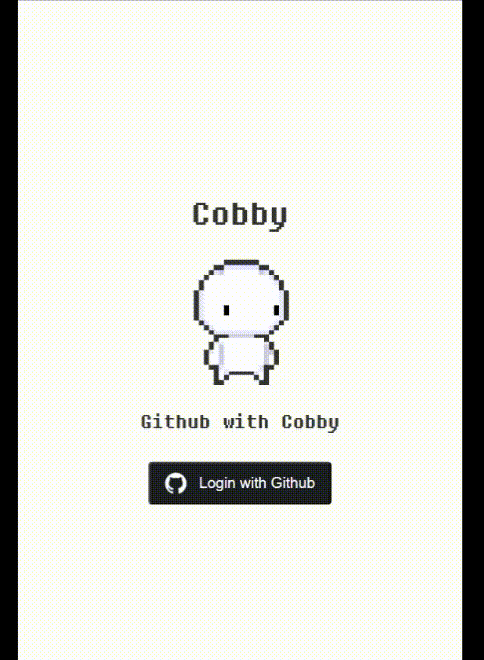
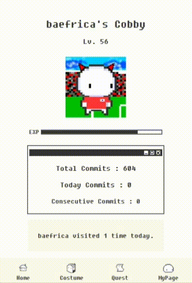
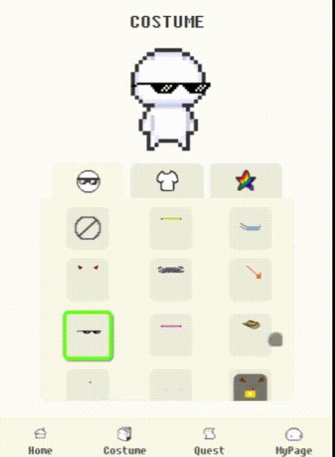
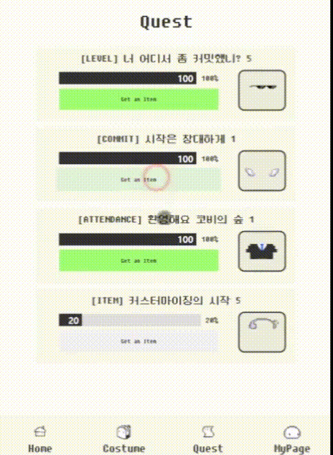
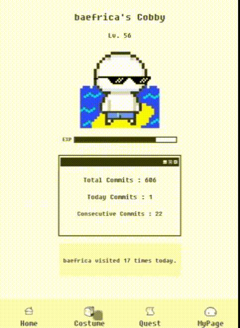
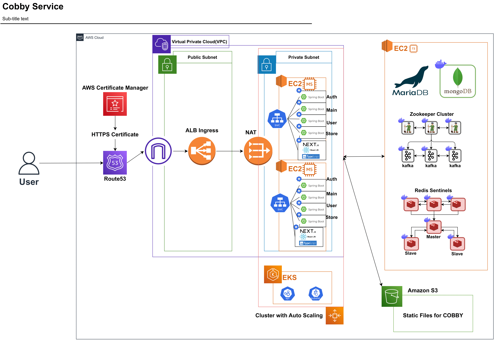
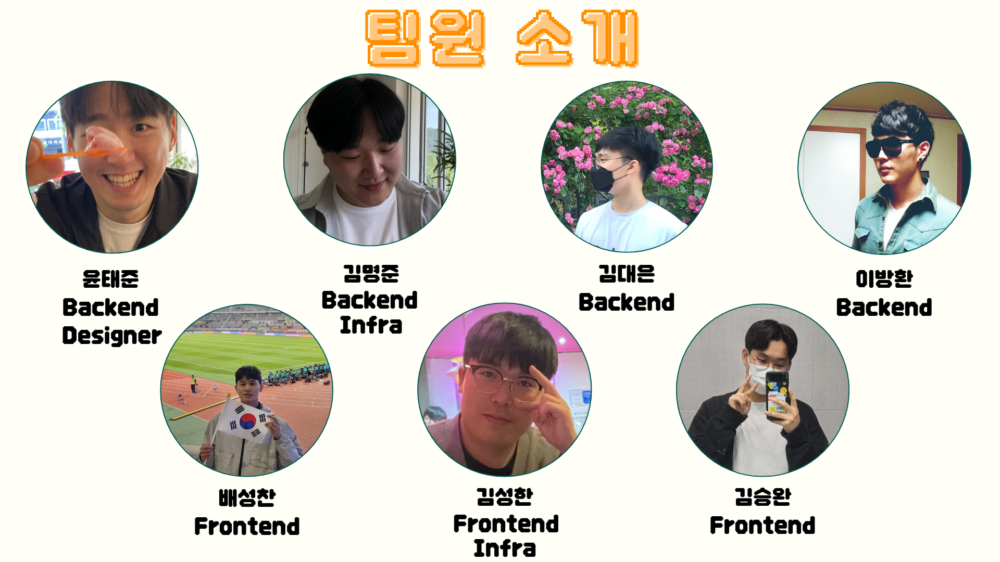
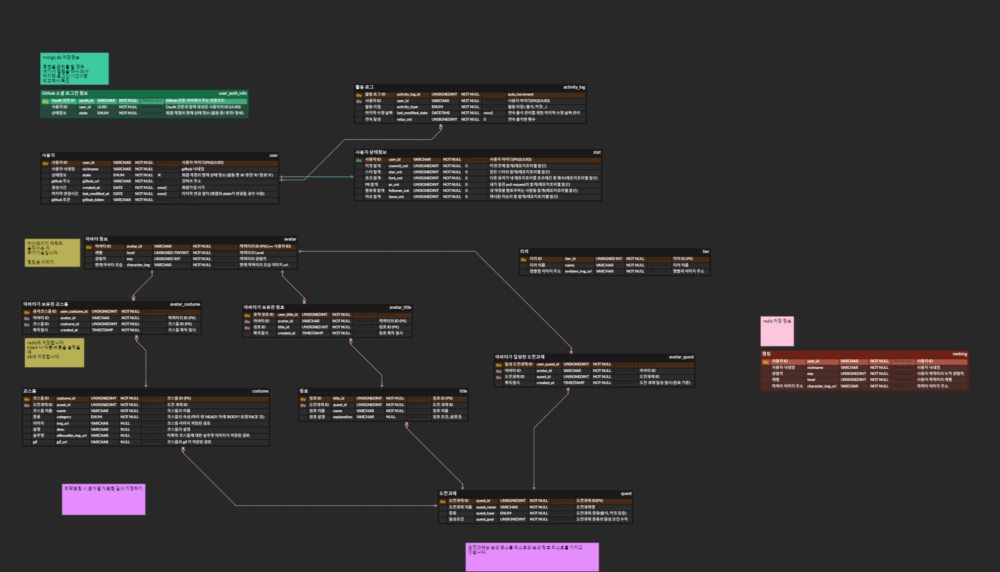

# Cobby - Github with Cobby

## 📌Index

1. [Cobby - Github with Cobby 서비스 소개](#Cobby---Github-with-Cobby-서비스-소개)
2. [주요 기술 스택](#wrench-주요-기술-스택)
3. [개발 기간 및 팀원 역할 소개](#two_men_holding_hands-개발-기간-및-팀원-역할-소개)
4. [프로젝트 산출물](#books-프로젝트-산출물)

# Cobby - Github with Cobby 서비스 소개

Cobby - Github with Cobby는 깃 커밋내역을 통해 귀여운 캐릭터 Cobby를 육성하는 게이미피케이션 서비스입니다!

저희 Cobby와 함께 즐거운 커밋활동을 해볼까요?

## 주요 서비스 화면

### ✔ 로그인페이지

- Github 소셜로그인을 통해 로그인합니다. 
  

### ✔ 메인페이지

- 닉네임, 레벨, 경험치, 커밋관련내역, 코비 서비스 연속 출석일수 등의 정보를 조회할 수 있습니다. 
  

### ✔ 코스튬페이지

- HEAD, BODY, EFFECT 세가지 유형의 아이템을 착용할 수 있습니다. 
  

### ✔ 퀘스트페이지

- 각 조건에 맞는 퀘스트를 달성하면 해당하는 에셋을 얻을 수 있습니다. 
  

### ✔ 마이페이지

- README BADGE export 기능과 코비 서비스 정보가 기입되어 있습니다. 
  

 

 

# :wrench: 주요 기술 스택

---

## Frontend

  
  
  
   
   
  
   

---

## Backend
  
  
  
   
   
   
   
   
   

---

## Database 

 
 
 

---

## Infra

  
  
  
  
  
  
  
  

---

# :two_men_holding_hands: 개발 기간 및 팀원 역할 소개

## 개발 기간

2023.04.10 ~ 2023.05.19 (6주)

## 팀원

# :books: 프로젝트 산출물

## Notion

[Notion](https://waiting-watch-1fa.notion.site/B201-0e05540135ed4f48ab9a8844889c1806)

 

## Mock-up

[Figma](https://www.figma.com/file/6cTU8M06FBDVJAaHRHIY4y/%EC%9E%90%EC%9C%A8PJT-%EC%99%80%EC%9D%B4%EC%96%B4%ED%94%84%EB%A0%88%EC%9E%84?type=design&node-id=0-1&t=tS9eERR4GlOfUhCS-0) 

 

## ERD

 
